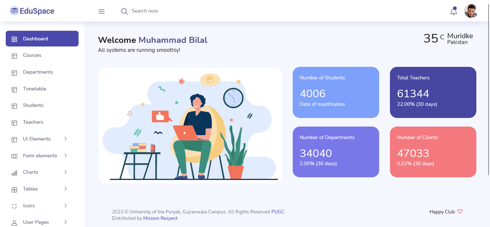

# EduSpace - Learning Management System

EduSpace is a learning platform designed to provide educators, administrators and
learners to create personalized learning environments.

<h1>Demo</h1>
Ali Mirza

#### Credits:

- Bootstrap 4
  
- Font Awesome
  
- jQuery
  
- Gulp
  
- Chart.js
  
- Google Maps
  
- Perfect Scrollbar

#### Browser Support:

- Chrome (latest)
  
- FireFox (latest)
  
- Safari (latest)

- Opera (latest)

- IE10+

#### University Project:
University Of thr Punjab
